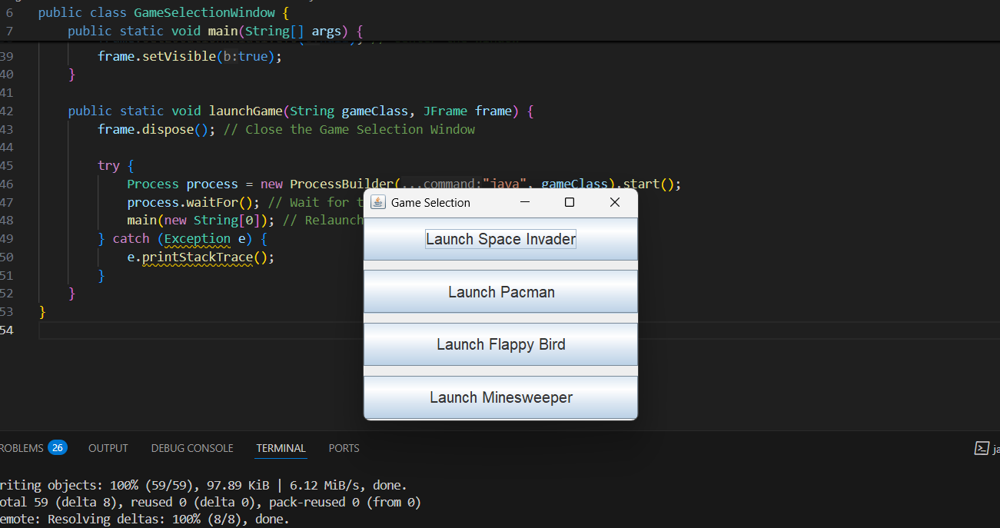

# Game-managament-system

This java project titled as Game-management-system utitlizes the the java AWT and swings classes in order to build user interactive games such as the flappyBird,
pacman,Minesweeper adn spaceInvader . Each of these games provide the user with interactive gaming experience which are bult with the help of java GUI classes.

Inorder to run this program,

Step1: compile the GameSelection Folder
javac -d . GameSelection/GameSelectionWindow.java

Step2:run the prgram using the command
java GameSelection.GameSelectionWindow

And boom here's how how your game setup looks like:

## Game Screenshots

### Space Invader

### Pacman

### Flappy Bird

### Minesweeper

